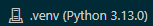

# datafun-06-eda
Module 6: Custom EDA

Dataset used: https://catalog.data.gov/dataset/affordable-rental-housing-developments

## How to Install and Run Project
**Create virtual environment**
```shell
py -m venv .venv
```
**Activate virtual environment**
```shell
./.venv/Scripts/Activate
```
**Install Dependencies**
```shell
py -m pip install --upgrade pip setuptools wheel
py -m pip install -r requirements.txt
```
**Running**

After activating virtual environment, use following command template to run in terminal. Outputs will be reflected in the database file (project.sqlite3).

```shell
py ./[script name]
```
To run in Jupyter notebook, click Kernel (top right) > Python environments > virtual environment. You can then run each cell (or all) in Jupyter notebook.
Icon in top right should look like the screenshot below:



**Viewing in GitHub Dev**

Link to view in GitHub Dev: [HERE](https://github.dev/crsellinger/datafun-06-eda/blob/main/cselling_eda.ipynb)